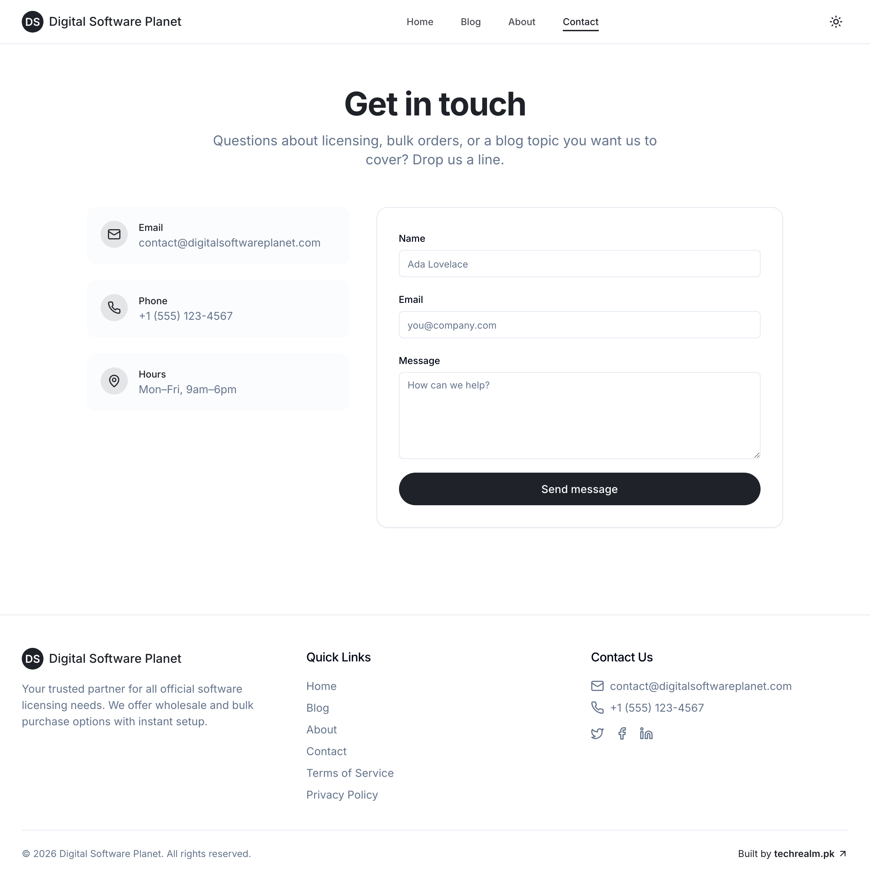

# Digital Software Planet 🪐

> Official software licensing, minus the runaround — wrapped around a fast, markdown-powered blog that actually explains the stuff nobody else does.

Digital Software Planet is a clean, animated marketing site + blog for a software-licensing business. It ships a landing page, a searchable blog index, individual articles rendered from live markdown, and honest little About/Contact pages. Built with **Vite + React + TypeScript + Tailwind + shadcn/ui**, so it's quick to boot and a joy to hack on.

<p align="center">
  
</p>

**Live demo — deploying soon.** (This repo is deploy-ready; a live link lands here once it ships.)

---

## ✨ What's inside

- **Polished landing page** — animated hero, feature cards, latest-articles preview, and a call-to-action, all with buttery Framer Motion transitions.
- **Searchable blog** — filter articles instantly as you type. No page reloads, no fuss.
- **Live markdown articles** — each post is fetched by slug from the content API and rendered with `marked`, then run through `DOMPurify` so nothing nasty sneaks into the DOM.
- **Light & dark mode** — a proper `next-themes` toggle that respects your system preference and remembers your choice. 🌗
- **Genuinely mobile** — a real slide-down mobile menu (not a button that does nothing), responsive grids, and touch-friendly targets throughout.
- **About & Contact pages** — including a validated contact form with friendly inline errors and a success toast.
- **Smart routing** — scroll-restores on every navigation, sane 404 page, and clean shareable slugs (`/your-article-slug`).

<p align="center">
  
  
</p>

<p align="center">
  
  
</p>

---

## 🚀 Quick start (from zero)

You need **Node.js 18+** and **npm**. Don't have Node? Grab it with [nvm](https://github.com/nvm-sh/nvm#installing-and-updating) — it's the painless way:

```sh
# install nvm, then:
nvm install --lts
```

Now clone and run:

```sh
# 1. Clone the repo
git clone https://github.com/waleedsworld/blogfetcher-magic.git

# 2. Hop in
cd blogfetcher-magic

# 3. Install the dependencies
npm install

# 4. Fire up the dev server (hot reload included)
npm run dev
```

Open the URL Vite prints (usually **http://localhost:8080**) and you're off. 🎉

### Build for production

```sh
npm run build      # outputs a static bundle to ./dist
npm run preview    # serve that bundle locally to sanity-check it
```

The `dist/` folder is plain static files — drop it on any static host (Cloudflare Pages, Netlify, Vercel, GitHub Pages, an S3 bucket, your fridge…).

---

## 🧩 Project layout

```
src/
├── components/         # Navbar, Footer, Layout, ThemeToggle, MarkdownRenderer…
│   └── ui/             # shadcn/ui primitives
├── pages/
│   ├── Index.tsx       # Landing page
│   ├── Blog.tsx        # Searchable article index
│   ├── BlogPost.tsx    # Single article (live markdown)
│   ├── About.tsx       # Story + values
│   ├── Contact.tsx     # Validated contact form
│   └── NotFound.tsx    # Friendly 404
├── services/
│   └── blogService.ts  # Talks to the content API
├── App.tsx             # Routes + providers
└── main.tsx            # Entry point
```

## 🔌 Where the content comes from

Articles are fetched from a content endpoint by slug:

```ts
// src/services/blogService.ts
fetch(`https://productdsp.techrealm.online/content/${slug}`)
```

Point `fetchBlogPost` at your own API to serve your own content — the renderer, sanitizer, and routing don't care where the markdown comes from. The blog index list currently comes from a small curated array in the same file; swap it for a live `GET` when your backend is ready.

---

## 🛠 Tech stack

| Layer | Tool |
|-------|------|
| Build | Vite 5 |
| UI | React 18 + TypeScript |
| Styling | Tailwind CSS + shadcn/ui |
| Motion | Framer Motion |
| Data | TanStack Query |
| Markdown | marked + DOMPurify |
| Theming | next-themes |
| Icons | lucide-react |

## 📄 License

Released for use and learning. Built with care by [techrealm.pk](http://techrealm.pk/). Go make something good with it. 🚀
