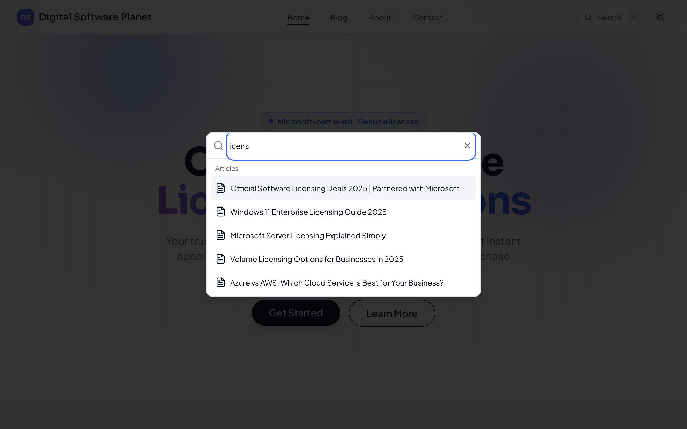
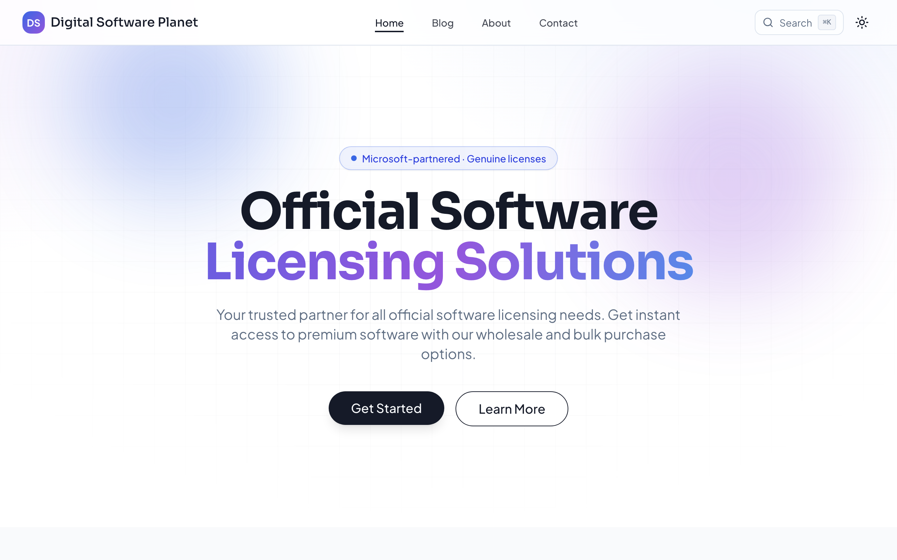
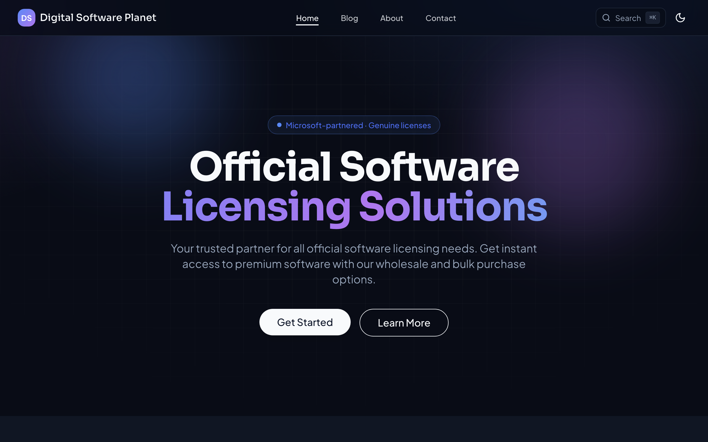
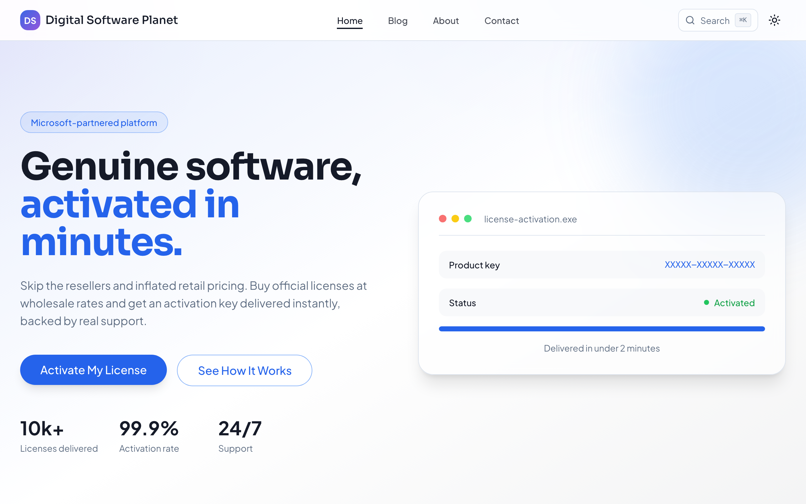
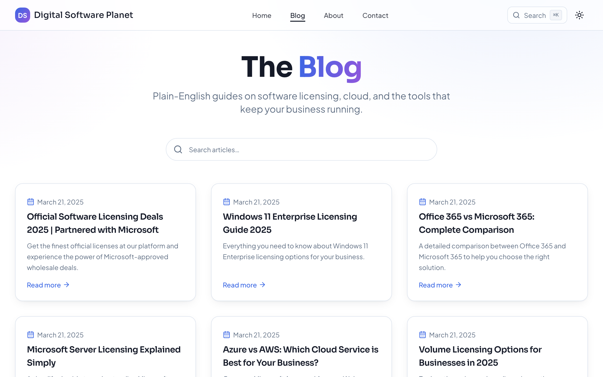
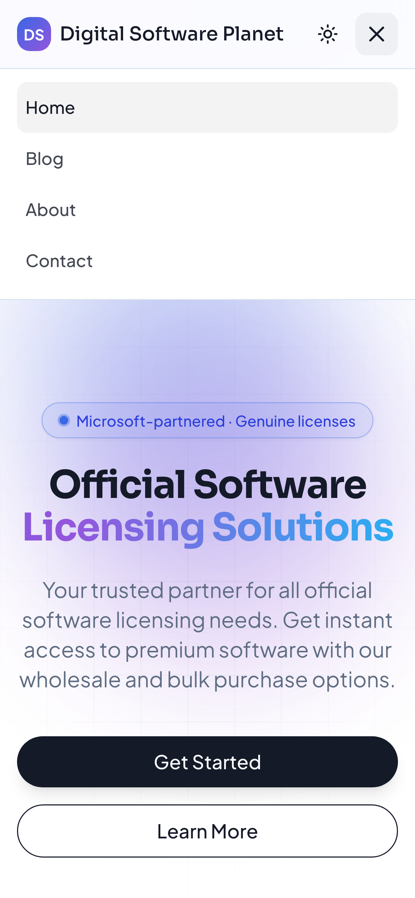
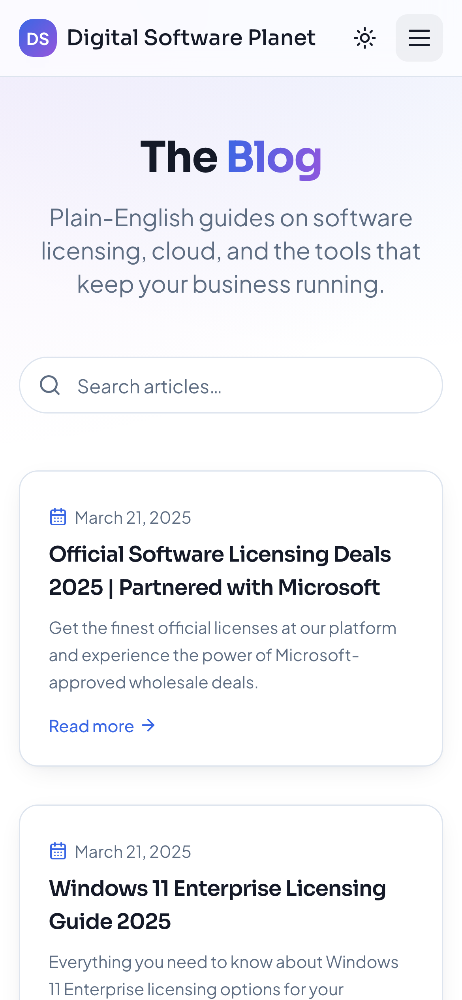

# Digital Software Planet 🪐

<p align="center">
  <a href="https://products.digitalsoftwareplanet.com/"></a>
  
  
  
  
  
  
</p>

> Official software licensing, minus the runaround — wrapped around a fast, markdown-powered blog that actually explains the stuff nobody else does.

**Digital Software Planet** is a polished marketing site **and** knowledge blog for a software-licensing business. Landing page, searchable blog, live-markdown articles with a scroll-spy table of contents, a `⌘K` command palette, light/dark themes, an A/B-tested hero, full SEO, and a real test suite. Built on **Vite + React + TypeScript + Tailwind + shadcn/ui** — quick to boot, a joy to hack on.

<p align="center">
  
</p>

<p align="center">
  <b>Live demo → <a href="https://products.digitalsoftwareplanet.com/">products.digitalsoftwareplanet.com</a> 🚀</b>
</p>

### TL;DR — clone, install, launch

```sh
git clone https://github.com/waleedsworld/blogfetcher-magic.git && cd blogfetcher-magic && npm install && npm run dev
```

Then open **http://localhost:8080** and you're licensed to browse. 🎉

---

## ✨ What's new (and worth showing off)

This release is a deep-enhancement pass. The greatest hits:

### ⌘K command palette — go anywhere, find anything
Hit <kbd>⌘</kbd><kbd>K</kbd> (or <kbd>Ctrl</kbd><kbd>K</kbd>) from any page. Fuzzy-jump to routes, search every article title, and fly through the site without ever touching the mouse. Because scrolling is *so* last decade.

<p align="center">
  
</p>

### 📑 Reading table of contents + progress bar
Long article? Each post auto-builds a **scroll-spy table of contents** from its headings (stable, shareable anchor IDs) and a **reading-progress bar** tracks how far you've gone. Deep-link any section; the TOC highlights where you are as you read.

### 🎨 A premium design system
An atmospheric aurora hero, refined typography (Plus Jakarta Sans + Sora), tasteful gradients, elegant elevation, and a first-class **dark mode**. It doesn't just work — it looks like it *wants* to be used.

<p align="center">
  
  
</p>

### ⚡ Accessibility + performance, baked in
- **Route-level code splitting** — every page is its own lazy chunk, plus vendor chunks (`react`, `framer-motion`, `marked`, `query`) for long-cache wins. The old 537 kB monolith is gone.
- **Keyboard-first a11y** — skip-to-content link, visible focus rings, ARIA labels, live-region loading states, semantic contact links.
- **Respects your wishes** — honors `prefers-reduced-motion` across CSS *and* Framer Motion; non-render-blocking font loading.

### 🧪 A/B-tested hero
Two complete landing treatments, switchable with a single query param — fully shareable, no build flags, no cookies. ([Jump to details ↓](#-landing-page-ab-variant))

<p align="center">
  
</p>

### 🔎 SEO & discoverability
Open Graph + Twitter cards, per-route `<Seo>` tags, JSON-LD (`Organization` + `WebSite` with `SearchAction`), `sitemap.xml`, a crawl-aware `robots.txt`, and an installable PWA manifest.

### ✅ A real test suite
Unit + component tests with **Vitest** and an end-to-end smoke test with **Playwright**, wired to **GitHub Actions** CI. Green check, clean conscience.

### 🛡 Hardened markdown & responsiveness
Wide tables now scroll instead of blowing out the layout, images lazy-load, external links open safely (`rel="noopener"`), long URLs wrap, and malformed/empty content renders a friendly fallback instead of a white screen.

---

## 🧭 The rest of the tour

- **Searchable blog** — filter articles instantly as you type. No reloads, no fuss.

  <p align="center"></p>

- **Live markdown articles** — each post is fetched by slug, rendered with `marked`, sanitized with `DOMPurify`, then enhanced (TOC anchors, scrollable tables, safe links).
- **Genuinely mobile** — a real slide-down menu, responsive grids, and touch-friendly targets throughout.

  <p align="center">
    
    
    
  </p>

- **About & Contact pages** — including a validated contact form with inline errors and a success toast.
- **Smart routing** — scroll-restores on navigation, a friendly 404, and clean shareable slugs (`/your-article-slug`).

---

## 🚀 Quick start (from absolute zero)

You need **Node.js 18+** and **npm**. No Node? Grab it with [nvm](https://github.com/nvm-sh/nvm#installing-and-updating) — the painless way:

```sh
nvm install --lts
```

Then:

```sh
# 1. Clone the repo
git clone https://github.com/waleedsworld/blogfetcher-magic.git

# 2. Hop in
cd blogfetcher-magic

# 3. Install the dependencies
npm install

# 4. Fire up the dev server (hot reload included)
npm run dev
```

Open the URL Vite prints (usually **http://localhost:8080**) and off you go.

### Build & test

```sh
npm run build      # static bundle → ./dist
npm run preview    # serve that bundle locally to sanity-check it
npm test           # run the Vitest unit/component suite
npm run test:e2e   # run the Playwright smoke test
npm run lint       # eslint
```

The `dist/` folder is plain static files — drop it on any static host (Cloudflare Pages, Netlify, Vercel, GitHub Pages, an S3 bucket, your fridge…).

---

## 🧪 Landing-page A/B variant

The home page ships with two hero treatments you can switch with a single query param — no build flags, no cookies, fully shareable and bookmarkable.

| Variant | URL | Treatment |
|---------|-----|-----------|
| **A** (default) | `/` | Centered aurora hero, headline _"Official Software Licensing Solutions"_, `Get Started` / `Learn More` CTAs. |
| **B** (experimental) | `/?variant=b` | Left-aligned two-column layout, benefit-led headline _"Genuine software, activated in minutes."_, trust badge + stat row + mock activation panel, urgency CTA `Activate My License`. |

Anything other than `variant=b` resolves to variant A, so every existing link keeps working. Everything below the hero (features, latest articles, CTA) is shared.

**How it works:**

- [`src/hooks/useVariant.ts`](src/hooks/useVariant.ts) — reads `?variant=` and returns `'a' | 'b'`.
- [`src/components/HeroVariantB.tsx`](src/components/HeroVariantB.tsx) — the experimental hero, rendered only for variant B.
- [`src/pages/Index.tsx`](src/pages/Index.tsx) — swaps the hero via `useVariant()`.

To wire this into analytics, read `useVariant()` where you fire your page-view event and tag it with the returned variant.

---

## 🧩 Project layout

```
src/
├── components/
│   ├── CommandPalette.tsx   # ⌘K global search & navigation
│   ├── TableOfContents.tsx  # scroll-spy TOC + reading progress
│   ├── HeroVariantB.tsx     # A/B experimental hero
│   ├── Seo.tsx              # per-route meta / OG / Twitter tags
│   ├── RouteFallback.tsx    # Suspense fallback for lazy routes
│   ├── MarkdownRenderer.tsx # hardened marked + DOMPurify pipeline
│   └── ui/                  # shadcn/ui primitives
├── hooks/useVariant.ts      # reads the ?variant= flag
├── lib/markdown.ts          # processMarkdown(): sanitize, slug headings, enhance
├── pages/                   # Index, Blog, BlogPost, About, Contact, NotFound
├── services/blogService.ts  # talks to the content API
├── test/                    # vitest setup + test utils
├── App.tsx                  # lazy routes + providers + MotionConfig
└── main.tsx                 # entry point
e2e/smoke.spec.ts            # Playwright end-to-end smoke test
```

## 🔌 Where the content comes from

Articles are fetched from a content endpoint by slug:

```ts
// src/services/blogService.ts
fetch(`https://productdsp.techrealm.online/content/${slug}`)
```

Point `fetchBlogPost` at your own API to serve your own content — the renderer, sanitizer, TOC and routing don't care where the markdown comes from. The blog index list currently comes from a small curated array in the same file; swap it for a live `GET` when your backend is ready.

---

## 🛠 Tech stack

| Layer | Tool |
|-------|------|
| Build | Vite 5 (route + vendor code-splitting) |
| UI | React 18 + TypeScript |
| Styling | Tailwind CSS + shadcn/ui |
| Motion | Framer Motion (reduced-motion aware) |
| Data | TanStack Query |
| Markdown | marked + DOMPurify |
| Command palette | cmdk |
| Theming | next-themes |
| Icons | lucide-react |
| Testing | Vitest + Testing Library + Playwright |

## 📄 License

Released for use and learning. Built with care by [techrealm.pk](http://techrealm.pk/). Go make something good with it. 🚀
